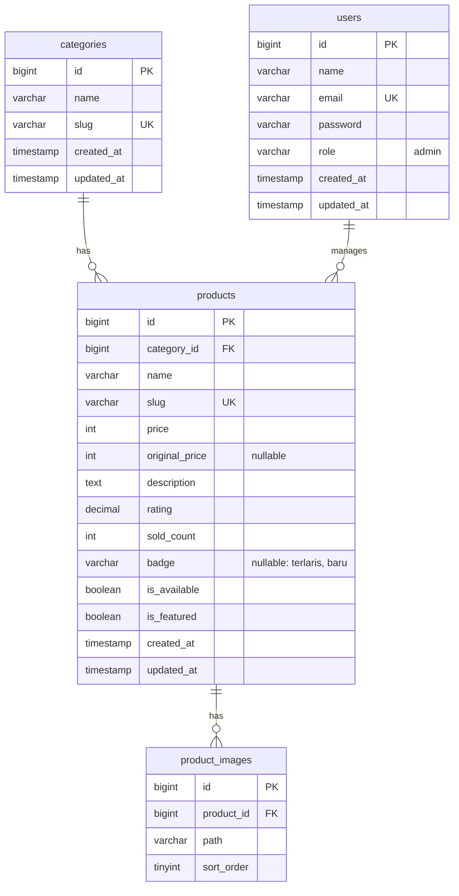

# ERD (Fase 2)

Disalin dari PRD bagian 7.2, ditambah kolom dari keputusan D2
(`original_price`, `rating`, `sold_count`, `badge`).

```mermaid
erDiagram
  categories ||--o{ products : has
  products ||--o{ product_images : has
  users ||--o{ products : manages

  categories {
    bigint id PK
    varchar name
    varchar slug UK
    timestamp created_at
    timestamp updated_at
  }

  products {
    bigint id PK
    bigint category_id FK
    varchar name
    varchar slug UK
    int price
    int original_price "nullable"
    text description
    decimal rating
    int sold_count
    varchar badge "nullable: terlaris, baru"
    boolean is_available
    boolean is_featured
    timestamp created_at
    timestamp updated_at
  }

  product_images {
    bigint id PK
    bigint product_id FK
    varchar path
    tinyint sort_order
  }

  users {
    bigint id PK
    varchar name
    varchar email UK
    varchar password
    varchar role "admin"
    timestamp created_at
    timestamp updated_at
  }
```
